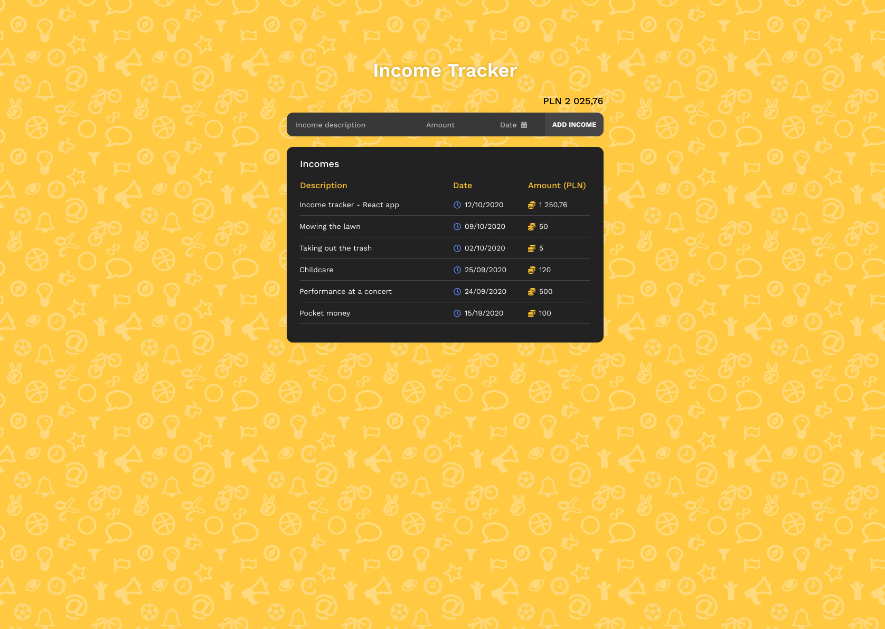

<p align="center">
  <a href="https://rawic.github.io/income-tracker/">
    
  </a>

  <h3 align="center">Income tracker</h3>

  <p align="center">
    Simple Income Tracker built with React.
    <br />
    <a href="https://rawic.github.io/income-tracker/" target="_blank" rel="noopener noreferrer"><strong>Live demo »</strong></a>
    <br />
    <br />
    <a href="https://rawic.github.io/income-tracker/issues">Report Bug</a>
    ·
    <a href="https://rawic.github.io/income-tracker/issues">Request Feature</a>
  </p>
</p>

## About Income Tracker

<a align="center" href="https://rawic.github.io/income-tracker/" rel="nofollow noopener noreferrer" target="blank">
  
</a>

## Getting started

### Prerequisites

- yarn

```sh
npm install -g yarn
```

### Installation

Using Yarn:

1. Clone the repository

```sh
https://github.com/rawic/income-tracker.git
```

2. Install NPM packages

```
yarn
```

### Built With

React:

- Font Awesome
- GSAP
- Moment.js
- React Day Picker
- Styled Components
- Styled Reset

## License

Distributed under the MIT License. See `LICENSE` for more information.

## Contact

Rafał Wichowski - [@rafalwichowski](https://twitter.com/rafalwichowski) - [hi@rawic.me](mailto:hi@rawic.me)

Project Link: [https://rawic.github.io/income-tracker/](https://rawic.github.io/Income-tracker/)

[app-screenshot]: readme/app-screenshot.jpg
